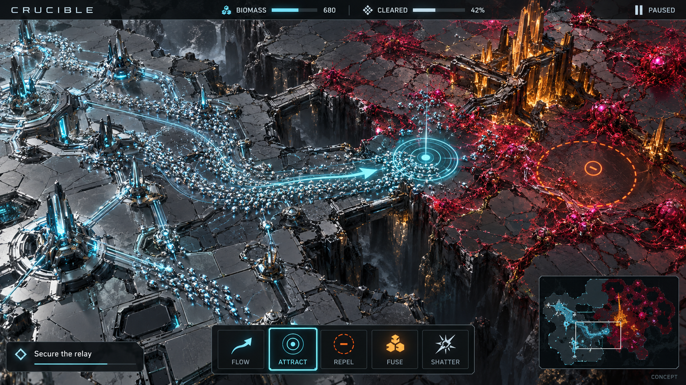
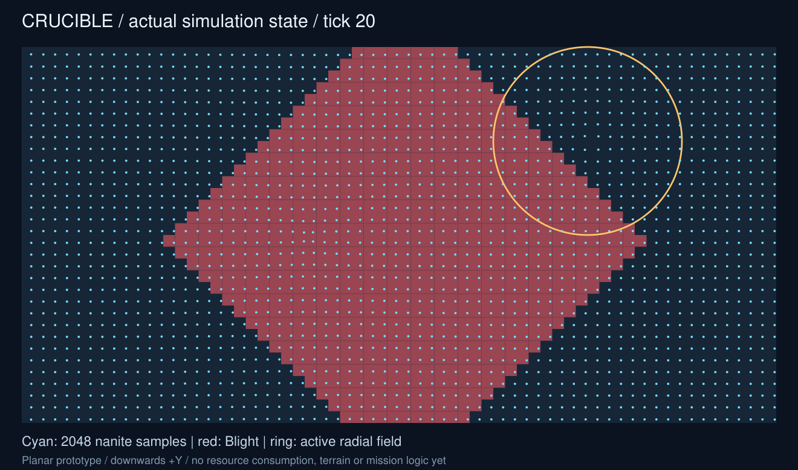

# Crucible

Crucible is a macro RTS about directing a vast machine swarm to reclaim an industrial
surface overtaken by cellular Blight. You paint currents, place attractors and
repulsors, and concentrate thousands of autonomous nanites where they are needed.
Gathered swarm mass can fuse into a stationary lattice, then shatter back into a
smaller mobile swarm when the front shifts.


*Generated world concept: a proposed visual direction, not a capture of the current executable.*

## What playing Crucible should feel like

You command a moving material. Silver ribbons stream across the map, gather around
your fields, clear infected cells and harden into amber structures. Strategy comes
from shaping routes and deciding where limited mass should remain mobile or become
anchored. Blight keeps spreading while you plan; abandoning a front has consequences.

The core loop is **observe -> direct -> reclaim -> concentrate -> fuse or redeploy**.
Spatial tools express your intent, and autonomous local behavior turns it into
large formations. A readable top-down/high-oblique RTS view lets you pan, zoom,
pause and inspect the frontier. Nanites, infected cells and structures must remain
distinct when thousands of them fill the screen.

## The first playable slice

The proposed first mission, **Secure the relay**, uses one bounded arena, one swarm,
one Blight rule and one fused structure type. Guide the swarm through the infected
frontier, reclaim a foothold and concentrate enough mass to form a lattice at the
relay. Hold that objective while sustaining enough mobile mass to finish reclamation.
Shattering lets you reposition a lattice's surviving mass, at a resource cost.

Victory combines reclamation progress and holding the relay; defeat comes from
losing the viable swarm before the objective is secured. Exact thresholds, spread
cadence, consumption/attrition and conversion ratios need reference fixtures and
playtesting. These are proposed design rules, not implemented outcomes.



*Concept HUD: spatial tools, a legible frontier, objective feedback and a tactical
minimap. Terrain, values and effects are illustrative.*

The initial slice is single-player and focuses on reclamation, concentration and
redeployment. Campaign progression, multiplayer, a broad unit roster and planetary
worlds are deferred. The first playable build needs usable input, display, pause,
restart and visible win/loss feedback as well as a correct simulation.

Read the [game design and project intent](docs/game-design.md) for the player role,
design pillars, commands, biomass economy, scenario, scope and open decisions.
The [concept gallery](docs/concepts/README.md) also shows nanite, fused-lattice and
Blight material studies, with the exact generation prompts recorded.

## Project status

**Status: third integrated headless increment.** Bounded field commands, tick trace
replay, a stable spatial grid, radial forces and double-buffered Blight spread are
implemented alongside bounded separation steering, a fixed-step clock and owned
state snapshots. Opt-in finite reclamation now transfers substrate stock into a
conserved reserve ledger, with staged Blight clearing and exact full-state replay.
Spatial bins consume pinned Sub0HexGrid H2 geometry with bounded compatibility
fallbacks. The original ECS workload and stack round-trip test remain. Full
swarm gameplay and rendering remain planned. The design
target is 100,000–150,000 entities at 60 FPS; this is not a measured game result.

The sub0 ecosystem supplies the simulation foundation. Scale is useful when it makes
the swarm feel continuous and alive; a clear, playable small scenario comes first.
The next simulation packages lead toward reserve deployment and a usable
input/presentation loop. [Architecture](docs/architecture.md) describes how those systems
fit together; [work breakdown](docs/work-breakdown.md) assigns their implementation gates.

Crucible also forges stronger reusable sub0 libraries: real application increments
feed back clearer contracts, fixtures, integration examples and measured improvements.
The [reuse catalog](docs/reuse/README.md) tracks existing libraries and extraction
candidates, including [Sub0HexGrid groundwork](docs/reuse/Sub0HexGrid.md) for the likely
hexagonal spatial direction. Gameplay policy stays in Crucible; extraction and
upstream changes follow concrete consumer and validation gates.

The visible world is a local patch. [Future terrain direction](docs/decisions/terrain-and-world-extension.md)
preserves varying height, mining that forms depressions and permanent fused bridges,
with possible spherical subdivision later. These remain future gameplay increments.

## Build

Requires CMake 3.25+, Ninja, Git and a C++23 toolchain (GCC 13+ or current MSVC).

```sh
cmake --preset debug
cmake --build --preset debug --parallel 4
ctest --preset debug
./build/debug/crucible
```

On Windows use a VS developer prompt and build/debug/crucible.exe.

Dependencies use one verified CPM 0.42.1 bootstrap, namespaced targets and full
commit pins in [cmake/DependencyPins.cmake](cmake/DependencyPins.cmake):
Sub0ECS **v2**, Sub0Pub **v2**, Sub0Pipeline main, Sub0Log main and Sub0HexGrid H2. Dependency developer
tools are disabled. Set CPM_SOURCE_CACHE for a reusable dependency source cache.

See [CONTRIBUTING.md](CONTRIBUTING.md) for Debug, Release and sanitizer workflows,
[benchmarking](docs/benchmarking.md) for reproducible evidence capture, and
[architecture](docs/architecture.md) for the design and integration boundaries.
Functional CI runs on Linux and Windows; benchmark CI is manual and advisory.

The [workstream map and session guide](docs/workstreams/README.md) is the entry point
for parallel development, with dedicated docs, source and test areas for each stream.
The [agent work breakdown](docs/work-breakdown.md) maps the proposed architecture
to implementation gates, ownership boundaries and team dispatch waves. Claim paths
and long CPU runs in [the active work log](docs/ACTIVE_WORK_LOG.md).
The [first-wave handoff](docs/workstreams/integration/wave1-validation.md) records
the four agents' deliverables, review, validation and remaining gates.
The [sprint-review archive](docs/sprint-reviews/README.md) records work delivered,
findings, validation, lessons and follow-ups for each completed phase.
Development proceeds through [reviewed phases](docs/phases/README.md), reassessing
and consolidating workstreams at each phase start. The [phase 2 plan](docs/phases/phase2.md)
prioritizes bounded steering, runtime observation and owned state inspection, with
an actual-state visual export, now delivered. See the [phase 2 handoff](docs/workstreams/integration/phase2-validation.md)
and [phase 3 delivery](docs/workstreams/integration/phase3-validation.md).

Source layout: include/crucible and src for simulation, tests for behavior and
stack integration, benchmarks for opt-in timing, cmake for dependencies, scripts
for evidence capture. Dependency licenses remain with their projects; Crucible's
own license has not yet been selected.

## Inspect the implemented scenario

```sh
./build/release/crucible --export-svg docs/concepts/phase2-state.svg
```

On Windows use `build/release/crucible.exe`. The file is an owned tick-20 snapshot
of the actual 2,048-sample scenario. It shows bounded movement, the remaining repulsive
field and Blight spread. Exact full-state replay is covered by the integration fixture;
the CLI checks complete state equality and prints replay diagnostics. This is a
diagnostic view; the playable input loop and mission rules remain pending.



[Open the SVG](docs/concepts/phase2-state.svg) or read [reproduction and visual evidence](docs/concepts/phase2-state.md).

## Inspect finite reclamation

```sh
./build/release/crucible --reclamation --export-svg docs/concepts/phase3-state.svg
```

The reference scenario starts with four substrate quanta per rectangular Blight cell,
one mass quantum per mobile sample, zero reserve and at most 64 successful actions
per tick. Harvest removes stock and adds exactly the same amount to reserve; exhausted
cells clear infection. Reinfection of exhausted material yields no extra mass.
The CLI checks complete replay and prints the conservation equation.
[Resource rules](docs/decisions/phase3-resource-rules.md) specify order and boundaries;
[phase 3 evidence](docs/workstreams/integration/phase3-validation.md) records review,
query parity and supported validation. Growth, attrition and fusion/shatter remain future work.

[Open the actual tick-20 SVG](docs/concepts/phase3-state.svg).

## Interactive inspector

The optional SDL3 prototype consumes owned ECS frames; it batches cells and nanites
without per-entity rendering interfaces. See the [rendering decision](docs/decisions/phase4-rendering.md)
and [phase 4](docs/phases/phase4.md).

```sh
cmake --preset desktop-release
cmake --build --preset desktop-release --parallel 4
ctest --preset desktop-release
./build/desktop-release/src/desktop/crucible_desktop
```

Windows executable suffix is `.exe`. Linux needs a native video SDK (X11 or Wayland)
and a display. The normal `release` preset stays headless and does not fetch SDL.
Use 1/2/3 or toolbar buttons for attract/repel/erase, Tab for field slot, click the
world to queue an edit, middle drag to pan, wheel to zoom, F to fit, Space to pause,
R to restart, Delete to erase and Escape to cancel preview. Queued edits apply at
a completed boundary; paused edits wait for resume. Restart discards the previous
run and trace. macOS build/test coverage is included in CI; iOS packaging, touch
input and physical-device validation remain future gates.

macOS requires the complete C++23 library used by Sub0Pipeline. The current Apple
SDK library lacks `std::stop_token`/`std::jthread`; CI uses Homebrew LLVM21 with its
matching libc++/libunwind, selected explicitly by the macOS presets:

```sh
brew install llvm@21
export CRUCIBLE_LLVM_ROOT="$(brew --prefix llvm@21)"
cmake --preset macos-release
cmake --build --preset macos-release --parallel 4
ctest --preset macos-release
./build/macos-release/src/desktop/crucible_desktop
```

This developer build uses runtime paths into the LLVM installation. A redistributable
Apple bundle and iOS toolchain require separate packaging/runtime validation.
