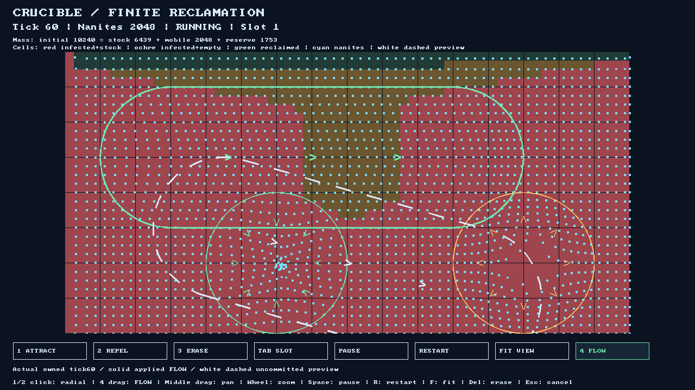

# Crucible

Crucible is a macro RTS about shaping a machine swarm to reclaim an industrial
surface overtaken by cellular Blight. Draw currents, place attractors and repulsors,
and redirect autonomous nanites across a spreading frontier. The structural mode fuses a gathered swarm into a holding lattice and shatters it
back into a smaller mobile swarm.


*Generated resource study. Stock and infection are separate; mobile and reserve are
forms of the same biomass. The lattice/shatter rule now has a primitive prototype; this illustration remains a visual target.*

## Playable now

The desktop prototype is a bounded reclamation challenge: recover **1,780 biomass
quanta before tick 900**. Pause stops the deadline. Flow and radial tools change
movement; the HUD reports progress, admission feedback and a latched win or loss.
Restart begins a fresh run. The reference scenario has 2,048 samples and conserves
`initial = remaining stock + mobile mass + reserve`.



*Actual production SDL software export at tick 60. Direction arrows distinguish
applied fields from the dashed preview. [Capture provenance](docs/workstreams/integration/phase8-validation.md).*

Phase 8 was recovered and [merged in PR 21](https://github.com/CraigHutchinson/Crucible/pull/21).
Its [review](docs/sprint-reviews/phase-08.md) separates original local validation from
publication. The default desktop uses the concrete software painter; an optional
Vulkan instancing receiver has separate readback and fault fixtures. Human usability,
physical-device performance and iOS receiving remain open.

## Direction and next increment

**Secure the relay** adds a real mobility tradeoff: gather 64 mobile identities at
the relay, fuse, hold 120 completed ticks and harvest 1,780 by tick 900. Shatter
returns 48 identities and records 16 permanently lost. Conservation includes anchored
and lost mass; rejection, restart and complete replay are received separately from
human tuning. Phase9 selected the rules; [Phase10](docs/phases/phase10.md), merged in PR23, implements
the live primitive loop. F fuses and X shatters in `--structural` desktop mode.
Primitive cells, points, arrows and lattice marks come before visual fidelity.


*Generated future-mode study. Circle/cyan, triangle/amber, diamond/violet and
square/lime identify factions independently of nanite or Blight kind. “Last faction
standing” is a proposal; authority, combat, elimination and networking are future rules.*

The [game design](docs/game-design.md) owns product intent. The
[concept gallery](docs/concepts/README.md) records art interpretation and provenance;
the [architecture](docs/architecture.md) owns technical boundaries. Terrain height,
mining and permanent bridges remain [later world work](docs/decisions/terrain-and-world-extension.md).
The target of 100,000–150,000 entities at 60 FPS needs complete tick/frame measurements;
it is not an achieved game result.

## Build and play

Requires CMake 3.25+, Ninja, Git and a C++23 toolchain (GCC 13+ or current MSVC).
For images and other binary assets, [install and fetch Git LFS](CONTRIBUTING.md).

```sh
cmake --preset desktop-release
cmake --build --preset desktop-release --parallel 4
python scripts/run_tests.py --preset desktop-release
./build/desktop-release/src/desktop/crucible_desktop
# Structural relay mission:
./build/desktop-release/src/desktop/crucible_desktop --structural
```

Windows uses a VS developer prompt and `.exe` suffix. Linux needs X11 or Wayland
development libraries and a display. Use **1/2/3** for Attract/Repel/Erase, **4** for
Flow; **Tab** selects a field slot. Click for a radial edit, drag and release for a
straight current. Middle drag pans, wheel zooms, **F** fits (fuses in structural mode), **X** shatters in structural mode, **Space** pauses,
**R** restarts, **Delete** erases and **Escape** cancels a preview. Admitted edits
apply at the next tick boundary; paused edits wait for resume. Terminal runs permit
camera inspection and restart, and refuse field edits.

macOS CI uses Homebrew LLVM 21 and its matching C++23 standard library:

```sh
brew install llvm@21
export CRUCIBLE_LLVM_ROOT="$(brew --prefix llvm@21)"
cmake --preset macos-release
cmake --build --preset macos-release --parallel 4
python scripts/run_tests.py --preset macos-release
./build/macos-release/src/desktop/crucible_desktop
```

This is a developer build, with runtime paths into LLVM. Apple redistribution,
iOS signing/touch and lifecycle validation need separate receiving.

## Headless scenarios and investigations

The default graph stays SDL-free:

```sh
cmake --preset release
cmake --build --preset release --parallel 4
python scripts/run_tests.py --preset release
./build/release/crucible --mission
./build/release/crucible --mission --route
```

The passive and swept-attractor cases report outcomes, conserved biomass and exact
full-state replay. They are reproducible scenarios, not human playtests or benchmarks.
Historical [movement](docs/concepts/phase2-state.md) and
[finite reclamation](docs/decisions/phase3-resource-rules.md) exports remain available.
The opt-in [relay-density investigation](spikes/structural/README.md) uses the same
production Simulation, command ingress and owned snapshots; it adds no gameplay engine.

## Development

[CONTRIBUTING.md](CONTRIBUTING.md) covers presets, prerequisite checks, Debug/Release
and ASan/UBSan. Functional CI covers Linux, Windows and macOS, SDL-free headless and
software Vulkan receiving. [Benchmarking](docs/benchmarking.md) defines advisory
measurement and reproducible evidence.

Dependencies use a checksum-verified CPM bootstrap, namespaced targets and
[full commit pins](cmake/DependencyPins.cmake): Sub0ECS v2, Sub0Pub v2, Sub0Pipeline,
Sub0Log and Sub0HexGrid H2. Gameplay directly consumes ECS/H2; live input uses Pub v2 and completed boundaries
use a sequential Pipeline graph. Log supplies optional bounded runtime diagnostics
when `CRUCIBLE_ENABLE_DIAGNOSTICS=ON`; production builds omit it by default.
[Phase11](docs/phases/phase11.md) records scoped delivery, owned frame
publication, direct-path parity and lifetime receiving. Consumer builds disable dependency development tools.
The [owned sub0 roadmap](docs/reuse/sub0-roadmap.md) names upstream evolution requirements and receiving owners.
The [reuse catalog](docs/reuse/README.md) and [full-source adoption audit](docs/reuse/phase9-sub0-adoption.md) track concrete feedback and extraction candidates;
game policy stays local until an independently consumed boundary justifies extraction.

[Reviewed phases](docs/phases/README.md) select increments from the
[capability backlog](docs/work-breakdown.md). The [workstream guide](docs/workstreams/README.md)
defines ownership; the [active log](docs/ACTIVE_WORK_LOG.md) reserves paths and CPU.
[Sprint reviews](docs/sprint-reviews/README.md) retain findings, evidence and follow-ups.
The repository's own license remains undecided; dependency licenses stay with their projects.

Current: [Phase12](docs/phases/phase12.md) receives runtime budgets and opt-in bounded
diagnostics. [Phase13](docs/phases/phase13.md) proposes a balanced presentation,
interaction and sound slice, shaped by native receiving and measured limits.
