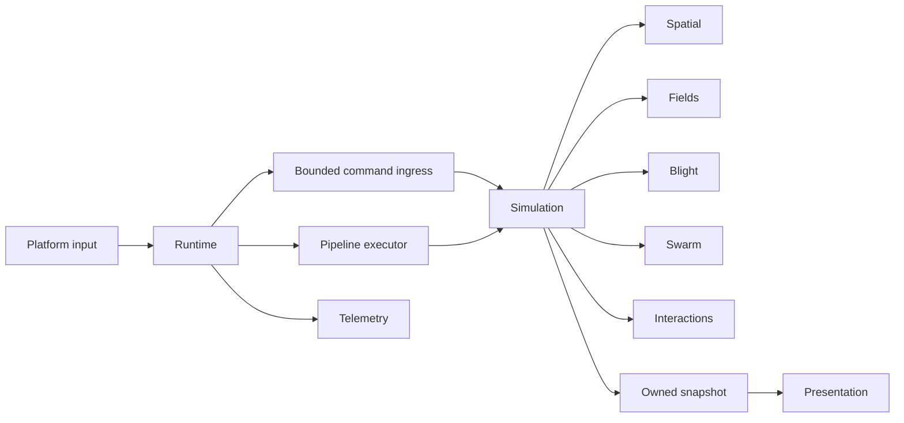

# Crucible architecture

Product intent and gameplay scope live in [game-design.md](game-design.md). This
document owns technical boundaries; [visual concepts](concepts/README.md) illustrate
the proposed experience without selecting a renderer or changing current physics.
The [reuse catalog](reuse/README.md) records upstream/extraction opportunities.
Hex spatial topology is likely but unresolved; [Sub0HexGrid](reuse/Sub0HexGrid.md)
has standalone scalar groundwork. The current rectangular implementation remains the verified baseline;
swarm indexing and Blight adjacency require separate migration decisions.

Status: second integrated headless increment, 2026-10-01. Bounded command admission,
tick trace replay, stable spatial queries, bounded separation/radial steering, clock
driving, owned state copies and cellular spread exist in a sequential optional scenario; full gameplay/concurrency remain planned. See
[workstream map](workstreams/README.md) for paths/status and
[work-breakdown.md](work-breakdown.md) for implementation gates.
The [hierarchy responsibility map](workstreams/hierarchy-boundaries.md) supplements
every module for the competing acceleration programme. It separates upstream geometry,
application occupied indexes, domain reducers, view/nav policy and executor lifetime;
no representation, new module, backend or dependency adoption is selected here.

The [phase 2 handoff](workstreams/integration/phase2-validation.md) is the authority
for implemented scope and evidence. HeadlessSession borrows an exclusively owned
Simulation; main owns both. The broader Runtime composition below is the target
architecture. The legacy Simulation constructor retains the ECS-only workload;
ScenarioOptions selects startup-owned grids, fields, scratch and stable sample IDs.
Scenario ticks spread Blight, optionally compute immutable-input bounded steering
(the prior radial-only path remains the absent-option behavior),
then rebuild the spatial grid. Consumption, alignment/cohesion and structural mutation remain pending.

## Goal and existing foundation

Crucible is a macro-RTS/swarm simulator: steer nanites with painted currents,
attractors and repulsors, consume cellular Blight, and fuse density into structures
that can shatter into a depleted swarm. The first slice is a bounded 2D world with
these mechanics and a snapshot-driven display. Networking, persistence, scripting,
an editor and planetary streaming are outside this slice.

The target is 100,000–150,000 active entities at 60 FPS, subject to full workload
measurement. Current Simulation owns Position/Velocity ECS data and integrates at
1/60 second. main runs headlessly. The stack test independently proves synchronous
Pub delivery -> deferred ECS tick -> sequential Pipeline telemetry -> decoded Log
record. Its source is now tests/integration/stack.cpp. It does not prove threaded
handoff or a production gameplay schedule.
[validation.md](validation.md) records prior Linux evidence and platform limits.

## Modules and production consumers

Use concrete modules and value contracts, without a generic engine framework or
single-implementation virtual interfaces. Reserved folders and INTERFACE targets
support parallel sessions; add APIs/implementations only with a named real caller.

| Module / planned paths under include/crucible and src | Owns | Consumer / dependency boundary |
|---|---|---|
| Existing Simulation facade | ECS world, tick state, simulation storage and coordinator commit | Runtime and headless scenarios; ECS and internal modules |
| contracts/ | Tick/sequence/entity identities, scenario limits, command and snapshot values, failure results | Runtime, simulation, presentation; standard C++ only |
| runtime/ | Clock, command ingress, Pipeline schedule, lifecycle | main; Simulation, Pub/Pipeline adapters, telemetry |
| spatial/ | Stable cell indexing, bins and complete radius traversal | Steering and interactions; immutable position/ID inputs |
| fields/ | Painted flows, attractors/repulsors and sampling | Steering; immutable per-tick field state |
| blight/ | Current/next cellular buffers and evolution | Simulation and interactions |
| swarm/ | Steering math and next-position/velocity outputs | Simulation; spatial and fields |
| scheduling/ | Executor adaptation and phase access declarations | Runtime; verified Pipeline executor API |
| interactions/ | Consumption arbitration, fusion/shatter proposals | Coordinator commit; immutable swarm/Blight input |
| presentation/ | Owned snapshot exchange, later drawing and input mapping | Runtime and desktop main; platform APIs in implementation only |
| telemetry/ | Bounded phase summaries and Log adapter | Runtime; no background ECS queries |

Runtime is the composition root and owns Simulation, ingress, executor, snapshot
pool and telemetry. Simulation owns its grids, fields and reusable scratch. Domain
modules receive scoped immutable input and exclusive output views; they retain no
world pointers. Rendering receives copied values, never ECS views. Simulation has
no platform/render, Pub callback or Log-global dependencies. Core now exposes only
ECS/Contracts plus project requirements; Swarm, Spatial, Fields and Blight are private. Runtime currently links
Core for headless running. Its future adapters will link Pub/Pipeline/Log explicitly.
Local workstream targets/source lists isolate parallel-session build edits. Reserved
targets contain no dummy objects and do not claim implemented gameplay.

## Pinned dependency constraints

The audit used the pinned sources, not assumptions about sibling HEADs:

- ECS 8391f81fd74a016564b4711b074eb286d3c5e14b requires trivially copyable
  components of at most 64 bytes, at most 64 component types and 32 declared queries.
  each<Cs...> must match a declared Query exactly. Large grids/buffers stay outside
  components; small IDs reference simulation-owned data. The integrator owns queries.
- Pipeline f6f54c623908649e8daac3613545062cf08b3822 builds graphs on one thread.
  Completion callbacks must drain; timed jobs can outlive run and require
  join_orphans before borrowed state is released. Initial ticks forbid timed/orphan
  work. All stop/error paths still join outstanding work before destroying captures.
- Its desktop executor creates a thread per job; the priority executor supplies a
  bounded pool. Both are currently disabled in Crucible. Sequential execution is
  the baseline; bounded parallel execution needs a separate integration gate.
- The sequential executor factory is publicly declared in the pinned header.
  The former manual declaration/comment has been removed from the integration test.

Pub callback/unsubscription and ECS capacity/identity guarantees require exact-source
verification before threaded use. A DAG alone never proves safe concurrent mutation.

## Ownership, capacities and time

Start sequentially at 60 ticks/second. Runtime uses a steady-clock accumulator,
allows at most four catch-up ticks per display iteration, discards excess wall time
and counts that discard. Headless replay advances an exact tick count independently
of wall time. Reproducibility means the same admitted commands, seed and ordering;
bit-identical floating point across different platforms is not promised.

Scenario configuration supplies finite entity/grid/field/command/proposal capacities.
Validate nonfinite values, dimensions, arithmetic overflow and storage budget before
startup. Preallocate scratch and snapshot slots; no steady-state buffer growth.
Measure ECS allocation behavior for structural transitions before claiming those
paths allocate nothing. Capacity failure returns an explicit result and retains a
valid prior state, without partial resource consumption or half-created structures.

Stable application EntityId includes generation/liveness semantics, never a row
offset; Simulation maps it onto the verified ECS identity API. Borrowed phase views
expire at barriers; all ECS borrows expire before structural commit. Cross-thread
commands own their payload, with no publisher pointers. Failure results are nodiscard.

## Command ingress

One input coordinator produces, one simulation coordinator consumes. Additional
input sources serialize through the producer. Start with a bounded mutex-protected
value ring. Pub is a typed delivery adapter into the ring, not the thread-safety
boundary. Its callback only validates/copies; it never mutates ECS or runs a tick.

Accepted commands get monotonic sequences. At tick start capture a cutoff, drain
only through that sequence, and leave later arrivals for the next tick. Record
accepted values, sequence and applied tick; replay injects that trace at boundaries.
Reject newest on full capacity and expose feedback/counters. Paint batches are
bounded and admitted atomically. Coalescing is deferred until replay semantics are
specified. Close/stop is out-of-band so a full queue cannot prevent shutdown; closed
ingress rejects admission. Pause stops ticks while ingress remains bounded.

## Tick schedule and data access

Read committed S(n), compute next state in scratch, commit S(n+1), then publish.
Boundary edits apply before forming tick inputs. World edges clamp positions; there
is no wraparound. Cell size and neighbor radius are scenario values; traverse every
cell intersecting the radius, including border cells.

| Phase | Reads | Exclusive writes | Prerequisites |
|---|---|---|---|
| Boundary | Accepted commands, committed state | Field edits, validated boundary structural changes, tick inputs | Previous tick and all ECS readers joined |
| Spatial rebuild | Tick-start positions/IDs | Counts, offsets, stable ID bins | Boundary |
| Blight step | Current Blight, immutable rule/field inputs | Next Blight buffer | Boundary |
| Steering | Tick-start state, bins, fields | Per-entity force scratch | Spatial rebuild |
| Integrate | Tick-start state, forces | Next positions/velocities | Steering |
| Interaction-bin rebuild | Next positions/IDs | Separate next-position bins | Integrate |
| Interactions | Next state/bins, next Blight | Partition proposals/reductions | Interaction bins and Blight step |
| Commit | Stable sorted proposals, next state | ECS values/structure, resource ledger, current Blight selection | All workers joined and borrows released |
| Extract | Committed S(n+1) | Free snapshot slot, summary | Commit |

Steering bins cannot be reused after movement. Spatial rebuild and Blight step can
run together only after access declarations are verified. Initially all phases run
sequentially. Parallel workers read gathered immutable dense input and write disjoint
scratch ranges or owned cell partitions. Only the coordinator accesses/mutates ECS.
Reductions merge in stable cell/EntityId order. Every task declares reads, writes and
partition ownership; overlapping writers require ordering or reductions. Build the
graph while quiescent, never concurrently; prohibit nested waits on a saturated pool.

Blight evolution writes next; interactions consume that next buffer, then commit
swaps it into current. Resolve consumption and non-overlapping fusion candidates in
stable cell/EntityId order. Validate complete resource/capacity transitions before
mutation. Shatter has a defined remaining budget and respects entity capacity.
Domain packages specify numerical rules and tiny reference fixtures before coding;
this architecture does not invent tuning thresholds.

## Snapshot exchange and teardown

Use three owned display buffers with free/writing/ready/reading states protected by
an exchange lock. Renderer acquires an RAII lease on newest ready data and releases
only after CPU reads and uploads requiring that memory complete. Never overwrite a
reading slot. Supersede ready data under the lock; if no free slot exists, skip
publication and count it instead of blocking simulation. Snapshots contain tick ID,
copied visible swarm/structures and Blight display data, never ECS/scratch pointers.
Headless mode can omit display payloads. Measure snapshot memory and extraction cost.

Shutdown closes admission, stops new ticks, finishes/joins all tasks, detaches Pub
subscriptions and drains active callbacks while ingress still exists, finishes GPU
uploads/releases leases, destroys presentation/executor/simulation, then flushes and
destroys telemetry last. RAII startup failure follows equivalent dependency ordering.
Task failure joins work, suppresses commit/publication and stops with an error;
boundary edits already applied are not rolled back, and continuing is unsupported.
World replacement requires the same quiescence. Resume applies queued values at the
next boundary.

## Validation and open decisions

Sequential execution is the parallel oracle. Replay identical seed/accepted trace;
compare exact identities, structural events and resource totals, with documented
numeric tolerances. Never depend on undocumented ECS iteration order. Test dense and
empty grids, borders, stale IDs, exhausted queues/proposals/entities, slow consumers,
pause/resume, startup failure, dispatch failure and repeated shutdown.

Require Debug/Release and supported ASan/UBSan; threaded packages also need supported
race checks or an explicit coverage limitation. Follow benchmarking.md for isolated
controlled timing. Whole-tick p95/p99, command age, allocations, peak memory, density,
workers and drops matter; rendering additionally needs upload/presentation-inclusive
frame timings. ECS microbenchmarks do not prove game FPS.

| Decision still needing evidence | Closure |
|---|---|
| ECS identity/capacity and Pub callback lifetime | Exact pinned-source audit W0/W1 |
| Bounded executor joining/failure semantics | W0/W7; sequential until proven |
| Gameplay math/resource rules | W3–W6 reference fixtures and decision records |
| Graphics/window backend and platforms | W9 ADR before adding dependencies |
| 60 FPS target feasibility | W10 complete workload and W9 frame evidence |

Record consequential changes in docs/decisions/ when made, including affected
consumers, compatibility and acceptance evidence. Integrator approves shared-contract
changes before dependent agents apply them. No unused public flags or APIs.
