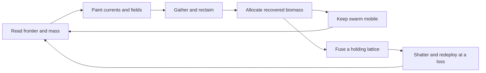

# Crucible: game intent and first playable design

Product direction updated for Phase10, 2026-10-05. This develops the existing swarm/Blight/fusion premise
into a concrete proposed game. New mission, resource and visual choices below are
design proposals for iteration, not claims of implemented or playtested behavior.
Read this before the technical [architecture](architecture.md) or work packages.

## The game we are making

Crucible is a single-player macro RTS about directing a vast, flowing machine swarm
to reclaim a surface overtaken by cellular Blight. The player shapes the swarm's
behavior by drawing currents and placing attractors and repulsors. Concentrated
nanites can fuse into a stationary structure, then shatter back into a smaller swarm.
The battlefield changes as Blight spreads, nanites consume it and the player moves
limited mass between reclamation and holding territory.

The intended fantasy is controlling a living material: a silver cloud pours around
an obstacle, gathers where you point, hardens into a lattice, then dissolves when
you need it elsewhere. Thousands of small local interactions should produce large
legible fronts and formations. The player's decisions concern routes, concentration,
territory and timing. Individual nanites remain autonomous; mass and fields are the
main tools of command.

The project is both a playable game and a demanding real-time simulation built on
the sub0 ecosystem. Technical scale serves that experience: the target of
100,000–150,000 entities matters when it makes the swarm feel continuous and alive.
A convincing, understandable small scenario comes before a measured large one.

## Future factions and control

The current single-player reference has nanites and Blight. Preserve the option
for more than two factions, including differently colored variants of either kind
as potentially controllable groups. Kind, allegiance, controller and palette are
separate concepts; different factions may be allied, neutral or hostile. This is
[extensibility groundwork](decisions/faction-extensibility.md), not implemented
multiplayer or new gameplay rules. Freeze resource ownership and command authority
at their first real consumers; Phase 6 only reviews rendering assumptions.

## Player, setting and viewpoint

The player is the operator of a reclamation swarm on a damaged industrial substrate.
The world is imagined at a scale where tiny machines, conduits and ceramic tiles
form an entire landscape. Blight is a spreading cellular material occupying that
surface. Its origin and any wider story remain open; the first scenario needs no
campaign, dialogue or characters to explain its decisions.

Use a top-down or high-oblique orthographic RTS camera with pan and zoom. At close
range, individual nanites and cells are readable. At strategic range, density,
motion, territory and structures carry the information. The first map is a bounded
2D arena. Height in concept art communicates material and depth; it does not commit
the simulation to 3D traversal.

Hexagonal spatial topology is a likely direction. The [Sub0HexGrid proposal](reuse/Sub0HexGrid.md)
separates reusable geometry from swarm binning and game rules. Choosing hex swarm
bins does not automatically change Blight's cardinal spread; cellular adjacency,
finite world boundaries and visual mapping need an explicit decision and fixtures.
The current rectangular grid is the verified implementation, not a final product constraint.

The visible arena is a local patch of a larger world. The user's future direction
adds terrain height for appearance and movement cost, mining that forms depressions,
and permanent fused terrain such as bridges. See [world/terrain direction](decisions/terrain-and-world-extension.md)
for resource and traversal gates and the preserved later spherical-world extension.
The current slice is still flat; terrain dynamics are subsequent consumed increments.

## Design pillars

1. **Shape behavior in space.** A current or field must have a visible, understandable
   effect. The player can predict where mass will go and revise that intent quickly.
2. **Make the collective readable.** Ribbons, density, fronts and fused silhouettes
   convey state at a glance. Tool overlays explain direction and influence without
   hiding the world.
3. **Make concentration a tradeoff.** A dense swarm clears a front effectively, but
   mass anchored in a structure cannot reclaim elsewhere. Shattering recovers less
   mass than fusion invested, so repeated redeployment has a cost.
4. **Keep consequences inspectable.** Pause, clear feedback and stable simulation
   ordering support learning. Resource loss, denied actions and spreading pressure
   must be explained visually.

## Core loop

Observe the infected frontier and available swarm. Paint a route or place a field.
Let the nanites gather and consume Blight. Use reclaimed biomass to sustain or expand
the swarm. Decide whether to keep that mass moving or fuse a portion into a lattice
to secure an objective. Redirect or shatter when pressure shifts. Repeat until the
scenario is reclaimed or the viable swarm is lost.

An example decision: a broad front is regrowing while a relay needs concentrated
mass. Pulling every nanite to the relay makes the objective easier but abandons
reclamation. Splitting the flow sustains the front but takes longer to fuse a lattice.
Pause permits planning; resume reveals whether the route and density were sufficient.

## Units, world elements and commands

| Element | Player-facing purpose | First playable behavior |
|---|---|---|
| Nanite | Mobile reclamation mass | Autonomous separation/alignment/cohesion plus field forces; consumes reachable infected cells under a bounded rule |
| Blight cell | Territory pressure and recoverable resource | Occupies a finite grid; spreads locally and can be depleted by the swarm |
| Fused lattice | Converts mobility into holding power | One stationary structure type; reserves swarm mass and protects a small objective area under an explicit rule |
| Relay | Gives the scenario a reason to concentrate mass | One visible objective marker; held by a lattice for a required duration |
| Reclaimed surface | Shows progress and safe operating space | Clearly distinct from infected cells; eligible to be reinfected unless protected |

The lattice is the only proposed structure in the first slice. Additional unit
classes, weapon trees and building economies are outside that slice. The lattice's
protection radius, consumption rate, spread cadence and conversion ratios must be
specified with resource-accounting fixtures before W4/W6 implementation.

| Tool | Intent | Feedback |
|---|---|---|
| Flow | Draw a directional route through the world | Visible arrow ribbon; local direction and strength overlay |
| Attract | Gather mass toward a point | Circular falloff preview and inward glyphs |
| Repel | Push mass away from an area | Different shape/dashed boundary and outward glyphs |
| Erase/edit | Revise an existing field | Hover highlight, selected field extent and confirmed removal |
| Fuse | Request a lattice at a chosen location | Eligible mass, cost and valid/invalid placement preview |
| Shatter | Redeploy an existing lattice | Expected recovered mass and loss preview before the action |
| Pause/resume | Inspect and plan | Unambiguous paused state; queued edits become visible at the next tick boundary |

Proposed desktop controls: select a tool in the bottom toolbar, drag in world space
to paint a flow, click to place radial fields, drag to move an existing field, and
adjust its radius/strength in a small inspector. Pan with middle-drag and zoom with
the wheel. Space pauses; Escape cancels the current preview. Exact bindings and
accessibility options are presentation decisions to validate with an interactive build.

Actions preview immediately in the UI. Confirmed state comes from committed snapshots.
A bounded input queue may reject an action; the UI must show that rejection and keep
the preview editable. A field indicator must never imply a rejected edit was applied.

## Biomass, pressure and meaningful failure

Use one accounting resource, biomass, for the initial design. Mobile nanites,
reserved structure mass and available biomass are distinct ledger entries. Clearing
Blight yields a defined amount; creating nanites transfers from the reserve; fusion
transfers mobile mass into a structure; shatter transfers only the surviving amount
back. Loss is recorded explicitly. A visual cloud is not an excuse to lose the ledger.

Blight is the first opposition. A local spread rule creates pressure on unattended
territory; the swarm can consume it, but handling a contested cell carries a defined
attrition cost. That cost must be tunable and visible, with a short fixture proving
no resource is created by contention or a failed transition. Finite reclamation now
uses a conserved stock/mobile/reserve/structure/lost ledger. Fixed-identity
fusion/shatter is implemented; contact attrition and population growth remain later.

The important tension is keeping enough mobile mass to reclaim while anchoring enough
to secure the objective. Difficulty comes initially from map geometry, infection
placement and spread/consumption balance. Combat AI and multiplayer are deferred.

## First playable scenario: Secure the relay

The [phase 5 reference challenge](decisions/phase5-reclamation.md) precedes this full
scenario: recover a visible biomass quota before a completed-tick deadline, with
latched outcomes and restart. It uses the live field tools and ledger without adding
structures or protection rules. Difficulty/comprehension require a human playtest.
The optional [GPU receiver](decisions/phase6-gpu.md) implements instancing and
readback receiving; the default desktop still uses the established software painter.

A compact bounded arena begins with a finite swarm, an infected frontier and one
relay marker beyond it. The player learns to gather the swarm, route it through the
frontier, reclaim a foothold and fuse a lattice at the relay. Blight continues to
spread outside protected territory. The player can shatter and reposition if an
early placement leaves the mobile swarm ineffective.

Proposed victory: meet a configured reclamation fraction and keep the relay protected
for a configured consecutive interval. Proposed defeat: mobile mass plus recoverable
structure mass falls below the minimum viable swarm while the objective is incomplete.
The HUD explains both conditions and shows progress. These thresholds remain tuning
parameters of the scenario, not values justified by the current code or artwork.

Begin on an obstacle-free reference arena to establish the loop. Static obstacles
and choke points in the visual concepts are a subsequent scenario gate: specify
traversability and avoidance before presenting those shapes as functional terrain.
Do not add collision or pathfinding merely to reproduce decorative art.

The playable acceptance is experiential as well as numerical: a new player can
understand the objective, see how each spatial tool affects movement, make a
concentration/redeployment decision, and reach a visible win or loss without a console.
Pause, restart, action feedback and a readable display are part of that acceptance.

## Screen and visual direction

The battlefield receives most of the screen. A compact top strip shows mobile mass,
reserve biomass, reclaimed fraction and pause state. A small objective card explains
relay progress. A bottom tool strip provides spatial commands; a contextual inspector
shows the selected field or structure. A minimap communicates infected territory,
swarm concentration, objective and camera footprint. Developer timings belong in an
optional diagnostic view rather than the ordinary play screen.

Proposed art direction: matte industrial ceramic/metal surfaces, silver nanites with
restrained cyan accents, rust-red/magenta cellular Blight and amber fused lattices.
Shapes and motion reinforce colors: points/ribbons for swarm, contiguous crust for
Blight, rigid interlocked geometry for structures. Keep material detail subordinate
to strategic readability. Overlays should be separable from the rendered world.

The [resource board](concepts/resources-v2.png) distinguishes stock, mobile mass,
reserve and a future lattice. The [faction/deathmatch board](concepts/factions-deathmatch-v2.png)
uses four color-plus-shape identities and variants of both organism kinds. The
[Phase9 comparison](phases/phase9.md) receives rule and actual concentration evidence
before selecting further gameplay. These material studies guide later fidelity;
primitive readable interaction comes first.

See the [visual concept gallery](concepts/README.md) for world, unit/material and
screen renders. These images are generated design explorations. Their HUD values,
terrain and visual effects are illustrative; they are not captures of the executable
or final production assets, and do not select a renderer.

## Scope and current reality

| Stage | What it establishes |
|---|---|
| Implemented increment | Straight drag FLOW and radial edits, bounded ingress/replay/clock, bounded steering, spatial diagnostics, finite ledger and live SDL display |
| Current mission increment | Quota/deadline challenge and optional one-relay fusion/protection/hold/shatter with progress/outcome/restart |
| Current investigation | Phase9 selected64→48+16 from actual density evidence; Phase10 receives the structural loop |
| Gameplay gate | One-lattice conservation/protection/hold received; future contact attrition and human tuning have separate gates |
| First playable gate | Snapshot display, input tools, pause/restart, objective feedback and a visual win/loss |
| Scale gate | Full tick/frame workload measured at small, 100K and 150K populations with rendering/uploads included |

For the first slice, defer campaign progression, networking, persistence, scripting,
procedural planetary worlds, an editor, a broad unit roster and multiple graphics
backends. The reference scenario must remain headlessly executable and replayable.

## Decisions to close before their workstream starts

- W5: steering equations, influence radii, force/speed limits and independent oracle.
- W4/W6: cell resource units, spread cadence, consumption arbitration, attrition,
  fusion eligibility, protected-area behavior and shatter recovery; prove conservation.
- W8b/W9: required visible snapshot values, camera/world mapping, readable density
  treatment and renderer/platform choice; prototype the actual tool interaction.
- Scenario integration: victory/defeat thresholds, seed/map, restart and tutorial cues;
  tune after playtests rather than encoding concept-art numbers.

This design explains why the workstreams exist. The [work breakdown](work-breakdown.md)
continues to own technical dependencies and acceptance gates; it should be revised
when gameplay decisions change. A design change that alters input, state or resource
semantics needs a decision record and notification to the affected stream owners.
