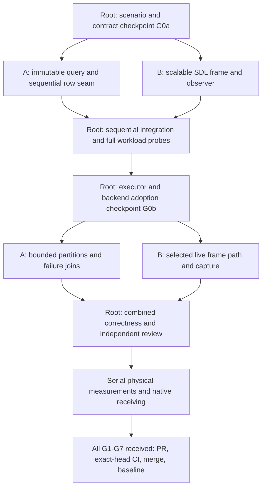

# Phase 14: interactive large-swarm performance milestone

Status: implementation authorized 2026-10-08; Pub main received and G0a frozen.
Reviewed planning finalized2026-10-08; runtime parallel adoption still awaits G0b.
Architect/root is accountable from design through integration, evidence and merge.
User selected **full-frame performance and bounded parallel simulation** as the
major sprint target. Planning baseline is clean main
`9e7fed990c404e95ab25e699090996aeec048040`, PR29, whose exact implementation head
`49f702a7dd5313805c927113dc358922cbd60952` passed all nine hosted jobs in
[run37619200451](https://github.com/CraigHutchinson/Crucible/actions/runs/37619200451).
PR29 closes P13-01 publication, not sound/native/participant receiving. See the
[preceding review](../sprint-reviews/phase-13.md), [contracts and design review](../decisions/phase14-scale-contracts.md),
and [Phase14 review record](../sprint-reviews/phase-14.md).

## Outcome and two-way design

Deliver a production desktop large-swarm scenario at **100,000 and 150,000 live,
fixed identities**, using a bounded worker executor for a consumed simulation
partition and publishing controlled, physical-device full-frame evidence. The
goal is a 60Hz simulation and a 60FPS presentation budget on one explicitly
qualified reference configuration. Neither population nor FPS is already received.
Both scales are core targets; missing either performance gate leaves this major
milestone incomplete rather than automatically moving the failing target to stretch.

Top-down: the operator watches a continuous swarm, draws FLOW, gathers/repels a
front, pans/zooms, pauses/resumes and restarts. The front and field direction remain
readable at overview and close range; queued/refused/applied input stays coherent
under load. Preserve the small secure-relay scenario as the complete gameplay
regression. Native scale interaction answers responsiveness/readability questions;
it does not establish new mission balance or participant comprehension.

Bottom-up: profile actual gather/index/query/steering/commit/resources/capture,
then packet or geometry construction, upload, HUD and presentation. Receive the
Spatial scratch seam, Pipeline dispatch/join behavior and bounded frame ownership
before parallel use. Reconcile density, worker count, visual fidelity and costs
with the desired experience through the same production path. A large headless
benchmark or offscreen readback is supporting evidence, not the delivered slice.

Retain complete simulation queries and resource rules. Visual culling/density
aggregation may improve overview readability, with explicit quality and counts;
it cannot change authoritative neighbor lists, identity participation or gameplay.
No terrain, dynamic population/recycling, factions, audio, multiplayer, concurrent
Pub producers or simulation/render overlap enters this core. P13-02 sound remains
a named follow-up. Synchronous parallel compute needs no concurrent snapshot exchange.

## Evidence-led scope and feasibility checkpoint

Current benchmarks measure ECS-only integration or small runtime routes. Desktop
uses 2,048 samples, a fixed64x32 world and a quota mission; raising only population
repeats positions and may quickly terminate simulation. Spatial queries and
Steering share mutable scratch. Pipeline's pinned priority pool has fixed workers
but an allocating queue; current consumer options disable both platform executors.
The GPU receiver is world-only offscreen1280x720 with readback, not world/HUD/window
presentation. These are prerequisite investigations, not parallel-safe capabilities.

Read-only Windows inventory found Core Ultra9 275HX (24 reported cores/logical
processors), Intel Graphics and RTX5070 Laptop GPU. This is availability evidence
only. G0 must receive actual selected renderer/device, driver, power/thermal mode,
toolchain and resource reservation. No device or 60FPS selection follows from inventory.

**G0a / initial contract checkpoint:** freeze scenario/observation schema, numeric
and visual criteria, ownership, query/storage bounds, reference-hardware scope and
safe sequential SDL probe before provider implementation. **G0b / adoption
checkpoint:** after Wave1's complete sequential receiving, freeze the measured
backend choice, actual GPU-completion observer and received executor/failure budget.
G0 means both checkpoints for parallel/backend adoption. Retain current native
SDL_Renderer as the complete-frame baseline;
it can be accelerated. Select one live GPU adapter only if the measured SDL path
cannot meet the frozen budget/quality target. That adapter becomes required core
with world, overlays, HUD and window lifecycle; do not bolt offscreen readback onto
every frame or promise a second backend. Limit this choice to one available public
desktop backend. Report infeasible target or unavailable capability explicitly and
seek a scope decision rather than weaken a gate after seeing a result.

## Workload and success gates

G0 records exact seed, initial state, grid/cell geometry, sample distribution,
field parameters/command trace, Blight/resource settings, duration and viewport/DPI.
Use a dedicated evolving scale scenario with enough finite stock and no early
mission terminal cutoff. This is a real Runtime/Simulation/Desktop consumer, not
the legacy ECS-only constructor. Every measurement reports completed tick delta,
active/terminal frame counts, zero/multiple-tick frames, displayed tick age,
neighbor/candidate counts and occupied-cell distribution. Static terminal frames
cannot satisfy the evolving workload.

| Workload | Scope and acceptance |
|---|---|
| 2K secure relay | Existing wins/refusals/fuse/shatter/replay/terminal/restart and direct/integrated behavior stay received; one-worker overhead regression gate |
| 100K and150K large world | Explicit approximately density-preserving world; starting candidates400x250 and500x300 one-unit cells. Freeze actual geometry and two live control routes at G0. Both routes at both scales must meet the full-frame targets |
| Same64x32 world at100K/150K | Distinct high-density stress, including repeated/coincident starts. Preserve complete queries and truthful timing/capacity behavior; no60FPS claim is promised for this pathological workload |
| Gathering/edges/coincidence | Normal route includes actual local concentration and pan/zoom; small exhaustive adversarial oracle cases and bounded dense large cases expose tails/failure. Never silently cap neighbors or dilute a failing workload |

Large-world geometry is a declared product/performance trade-off, not a claim that
the same arena became faster. Freeze normal-route concentration from actual probe
output and record it; unmeasured crowd distributions remain outside the performance claim.
Normal routes must manipulate a visible front rather than leave uniform bulk
untouched. G0a defines a representative distribution and consumed scale-specific
field parameters; G0b confirms >=10% of live samples experience field influence
over the route and a tracked front moves >=5% of world width attributable to the
field commands. Receive a matched no-command route or equivalent independent
direction/displacement comparison; initial velocity alone cannot satisfy this gate.
Record actual affected
counts/fractions, displacement, occupancy and neighbor tails from capture. These
are initial task targets requiring explicit scope review if unsuitable, not reasons
to thin neighbors or substitute an idle route.

Proposed numeric gates below are acceptance targets, not measurements. G0 may
refine measurement definitions before implementation; changing targets requires a
recorded architect/user scope decision, not an after-the-fact success classification.

| Gate | Required evidence |
|---|---|
| G1 correctness | Sequential and1/2/N-worker complete-state/replay agreement; exact identities, commands/results, stock/ledger/hold/mission, ascending neighbors and initially bitwise positions/velocities. Freeze/validate worker rounding/denormal/compiler FP mode against coordinator; unsupported modes use received sequential fallback. Any math reordering needs a separate preregistered oracle/tolerance decision before performance experiments |
| G2 bounded execution | Startup worker/queue/task/scratch capacities, full/rejected dispatch and join/failure tests; no worker ECS/structural mutation, no borrowed state beyond join, no per-token/per-row task creation, no allocations in the new kernel/query hot path; measured orchestration allocations reported separately |
| G3 frame budget | On frozen reference native configuration, whole evolving frame service p95<=16.67ms, p99<=20ms at100K and150K for both normal routes. Interval starts before event/boundary service and ends after that frame's required GPU completion and native presentation-call handoff, including slot/backpressure waits. G0b must execute a supported completion observer; absent observability blocks this gate. Report latency and overlapping throughput separately; never add unrelated stage percentiles |
| G4 pacing and input | Paced60Hz native run: presentation-call cadence p95<=17.5ms and p99<=33.34ms, >=59 presentations/sec, <=1% stale/repeated frames attributable to missed work after warmup. Tick rate remains60Hz with no accumulating catch-up debt. Running/visible steady-state accepted input reaches a correlated completed frame handed to native presentation at p99<=2 ticks+1 frame (50ms). Record event/admission/application/submission/completion identities; this is not physical input-to-photon/scanout timing |
| G5 useful parallelism | At least10% whole-tick p95 improvement for selected multi-worker arm versus same-source1-worker at one target scale, neither scale >5% slower; 2K auto/sequential whole-tick p95 no more than10% regression against matched baseline. Report frame effect and serial bottlenecks separately; reject harmful auto selection |
| G6 lifecycle/quality | Actual supported small window and native overview/zoom captures, visible FLOW/receipt/front; resize/DPI/fullscreen/focus/pause/restart/close, delayed GPU completion/full slots when applicable, no stale input or invalid resource release. Separate physical operator observations and participant protocol/results |
| G7 release | cpp-review, Debug/Release, supported ASan/UBSan, meaningful race receiving, production BUILD_TESTING=OFF/dependency omission, full unfiltered combined suites, all required exact-head CI, reviewable PR/merge and verified local/origin main |

G3/G4 use CPU wall time, supported GPU timers/fences and presentation-call timestamps
with scopes recorded. Actual scanout or physical input-to-photon claims require an
independent instrumented receiver and remain open otherwise. Headless timings and
shared hosted timings cannot close the physical frame-budget gate.
Latency acceptance requires >=300 accepted mutation events per core process arm
using the frozen active control script, with nearest-rank percentiles and raw
samples retained. Accepted domain refusals, admission rejections and intentional
pause/minimize/restart intervals have separate cohorts/counters and correctness
gates; no clock time paused is charged as running application latency. Record
every exclusion and event outcome, rather than quietly filtering inconvenient tails.

## Parallel packages and edit ownership

Retain **architect plus at most two workers**, with independent worktrees/build trees.
Assignments are proposed roles until dispatch, not claims that an implementation
agent is running. Root records branch/worktree, exact base and prerequisite SHAs,
resource claim and stop condition in ACTIVE_WORK_LOG at each dispatch. Worker paths
below include local manifests/tests/docs; all shared edits are root patch requests.

| ID / owner | Outcome, named production consumer | Exclusive paths | Prerequisites and gate |
|---|---|---|---|
| P14-00 / architect | Baseline/workload/capability freeze; production scale settings/launch and root frame-stage hooks | Contracts, Simulation/simulation.hpp, Runtime, DesktopApp/main, root CMake/pins/presets/CI, benchmark root inventory and central docs | G0a then G0b; consumes existing resource/command/publication contracts, no unconsumed knobs |
| P14-01 / workerA | Immutable concurrent radius query and ordered row kernel; Simulation's tick consumes full input and disjoint output | Spatial, Swarm, their include/src/tests/local manifests/docs | Root frozen epoch/scratch contract; sequential exhaustive parity before parallel dispatch, G1/G2 |
| P14-02 / workerA, next wave | Bounded Scheduling adapter/partition graph consumed synchronously by Simulation; upstream Pipeline requirement only if received API cannot supply bounded storage/failure semantics | Scheduling include/src/tests/docs; separately claimed Sub0Pipeline package if needed | P14-01 + executor contract; root alone wires Simulation and promotes pin after upstream independent receiving; G1/G2/G5 |
| P14-03 / workerB | Complete live scale frame/readable world; DesktopApp consumes painter or selected concrete live GPU adapter | Presentation include/src/tests, including ScenarioSnapshot and existing GPU compartment; explicitly assigned new live adapter files only, not DesktopApp | G0a snapshot/layout for sequential SDL receiving; G0b backend/slot receipt before GPU adoption; G3/G4/G6; no speculative renderer interface or camera policy in Spatial |
| P14-04 / workerB | Full workload/frame capture harness and schema; production DesktopApp/scenario exporter supplies observations | benchmarks/phase14_*, scripts/capture_phase14_*, docs/workstreams/integration/phase14-evidence and workerB handoff | Root owns existing benchmark scripts/manifests, so submit those edits as patches; G0a/schema before sequential probes (Wave0 schema/oracle preparation permitted), G0b before dependent adoption, G3-G5 after combined correctness |
| P14-05 / architect | Combined receiving, independent review, native operation, evidence, defaults decision, publication and cleanup accounting | Integration tests, shared hooks/wiring, central docs/ACTIVE log | All provider handoffs and G1-G7; preserves unrelated trees/artifacts |

WorkerA consolidates W3/W5/W7 for this slice because query scratch and partition
lifetime are inseparable prerequisites. Domain ownership stays Spatial/Swarm/
Scheduling; Runtime chooses policy and owns the outer BoundaryPipeline. WorkerB
consolidates W8b/W9/W10 because the renderer and production-frame observer must
measure the same consumer. Root defines shared values and all central wiring;
ScenarioSnapshot belongs exclusively to B, with root-requested publication changes.
Fields/Blight/Interactions retain sequential policy, Telemetry existing diagnostics;
navigation, hierarchies, new residency libraries and broader platforms are deferred.
See [responsibility supplement](../workstreams/hierarchy-boundaries.md#phase14-proposed-scale-assignment).

## Wave order and orchestration

1. **Wave0, bounded feasibility:** root audits claims/baseline and authors the scale
   scenario/schema; A audits query and exact Pipeline failure/join storage; B prepares
   complete SDL frame capture and native readability probe. Freeze G0a after
   one consolidated design review. Independent oracle/capture preparation may run
   in parallel; dependent implementation waits for the checkpoint. Serial probe runs.
2. **Wave1, sequential receiving:** A delivers the immutable query/row seam with
   unchanged math; B delivers scalable complete SDL path and observation hooks;
   root wires scenario/capacity/replay. Receive2K and both target scales. Make the
   G0b one-backend/executor/completion-observer decision from this evidence, with an explicit bounded GPU package
   only if required. Publish a reviewable source checkpoint before long acceptance.
3. **Wave2, parallel and frame refinement:** A receives bounded executor and
   partitions; B receives selected live renderer/fidelity and capture. Root integrates
   dependencies first. Require three unsuccessful refinement passes before parking
   a mechanism; continue useful candidates, keep them toggleable and document
   combination results. No scope expansion into simulation approximations.
4. **Wave3, major acceptance:** root reviews combined consumers, serializes full
   correctness/race/device acceptance, performs controlled comparisons and native
   interaction, inspects actual captures, resolves findings, then publishes/merges
   the accepted source with exact-head CI. Reopen only changed/failed gates.

Independent source work is parallel; CPU-heavy builds and CPU/GPU measurements are
serialized across Crucible and sibling projects. Start measurements only after
all active owners release competing hardware claims. No delivery deadline is
invented; G0 records estimated effort and available quota from actual probe findings.

## Measurement and handoff

Follow [benchmarking](../benchmarking.md), extended here to the whole production
consumer. Build baseline/current once with the same compiler/flags. Use >=5
independent rotated/alternating process pairs, startup plus120 warmup ticks,
then at least1800 evolving frames AND30 seconds per core acceptance process arm.
Shorter feasibility probes establish no acceptance percentile. Freeze any larger
minimum before capture; changing the minimum requires an explicit scope decision. Run
timeouts/insufficient samples are failed/incomplete evidence, never extrapolated
passes. Record thermals or stable power/cooldown/load confounds, worker count and
affinity, display/DPI/VSync, selected physical renderer/device/driver, diagnostic
state, resident/peak memory and replaceable allocation count/bytes by stage.

Compare (a) PR29 behavior-compatible sequential baseline, (b) same-source1-worker
seam, (c)2-worker and selected boundedN, and (d) selected renderer combination.
The scale harness added to baseline must be identical/reviewed and carry its own
source/tree hash; do not claim stock PR29 supports the new scale scenario. Retain
raw frame timelines, tick/query counts, commands, failures and process results,
not just medians. Startup/steady/camera-only/focus/minimize timings are separate.

Every handoff gives exact base/commits/paths, real caller, contracts changed,
shared patch requests, executed commands/counts, raw artifact/source hashes,
limitations and unmet gates. Architect checks L0 consumers, L1 ownership/dependency
direction and L2 lifetime/capacity/error contracts plus cpp-review before accepting.
Race evidence covers failing/blocked workers and late callbacks, not only fast runs;
if TSan cannot run locally, record that limitation and receive a capable hosted run.

Sound/native/human backlog and platform trust limits remain explicit. New captures
must follow existing artifact/LFS policy; do not activate a blocked write workflow.
At close update fresh-viewer launch/controls/scale/backend requirements, actual
performance envelope, review/merge receipts and retained worktree/artifact state.
Do not call the major milestone complete on code merge alone when G3/G4 remain open.

## Reuse, carried work and bounded stretch

R03/P11-F03 supplies the consumed Scheduling executor requirement; R05/R06 retains
H2 geometry and local complete occupied queries; R07/R08 retains game orchestration
and policy locally. Improve Pipeline upstream only with an exact-source reproduction,
bounded dispatch/join requirement, standalone package tests and full-pin consumer
receiving. No new generic executor, spatial library, MemPage or TieredCache adoption.

P01-F05 (original structural/concurrent scale ID) and HW-05 are core. Later reviews
loosely associate P01-F03/F04 with scale; preserve original meanings: resource/growth
and input/rendering respectively. P11-F03 closes only the received executor subset;
concurrent Pub remains open. P12-F01/P04-F02 native input/readability are partially
received through G6; participant balance/comprehension remain separate. HW-06 and
P06-F02 retain safe physical failure gates; G6 closes only explicitly exercised cases.

Carry P12-F02/P13-02 audio; P09-F01/P05-F01 human tuning; P01-F03 dynamic growth/
attrition; P06-F01 factions; P04-F01/F03 iOS; P02-F02 concurrent snapshot exchange;
P02-F03/P03-F01/HX-07 terrain/geometry with their existing owners and gates. Core
adds no actor growth or topology change. Stretch only after G1-G7: one measured
spatial/commit refinement or additional display-size capture, not another backend,
audio framework, terrain or simulation/render pipeline overlap.
