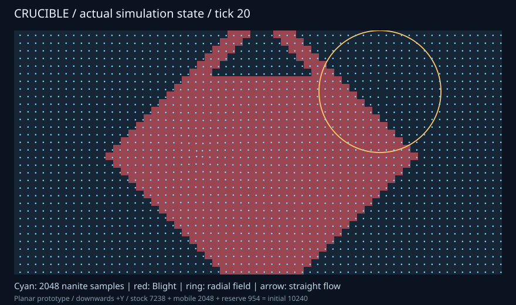

# Phase 11 sprint review: production sub0 backbone

Status: implementation/local receiving complete, 2026-10-05. Architect accountable.
Baseline [PR23](https://github.com/CraigHutchinson/Crucible/pull/23) merge
`262c4eba4211779042f17bf5a2da03d333c35a91`; [plan](../phases/phase11.md).
[PR24](https://github.com/CraigHutchinson/Crucible/pull/24) owns the final exact-head
CI, reviewed tree and guarded merge/main receipt. No unconfirmed job is counted.

## Delivered increment and delegation

Desktop input, scripted mission routes and scenario exports consume scoped Pub v2
admission and a startup-built inline Pipeline boundary/capture/mission graph. ECS
remains exclusively coordinated with fixed retained identities. Game rules, queue
validation/cutoff and replay remain shared; direct execution is a narrow comparator.

Delivery worker owned one private domain/sink, owned receipts and admission/lifetime
fixtures. Execution/state worker owned the graph, publication/failure fixtures and
exact-source ECS/Pipeline audit. Architect integrated production callers, mission
commit order, clock terminal closure, full-state parity, packaging and central docs.
Simulation/presentation rules consolidated under receiving; no extra agent or
independent rules implementation. Workers cross-reviewed, architect reviewed all
source/hand-offs. Current pins suffice; upstream evolution is driven by a received
gap rather than forced churn.

## Findings and resolutions

| Finding | Resolution and evidence | Limit |
|---|---|---|
| A copied intermediate Pub batch would duplicate capacity policy/counters | Synchronous typed span, immediate existing ingress copy; malformed oversized/refusal/counter parity | Borrow lasts only through publish; coordinator-only adapter |
| Noexcept callback could terminate on an ingress exception | Capture exception_ptr and rethrow after Pub returns | No arbitrary concurrent receipt clients |
| Capture/mission failure could expose inconsistent output | Two frames retain previous publication; inspector stages mission until graph success; callback exception fixture | Committed world work is fail-stop, not rollback |
| Cancellation could poison graph reuse | Pause→cancel→resume→advanced fixture; repeated structural epochs | Inline untimed executor only |
| Clock-level trace-full parity was missing | Production tiny-trace inspector/direct pair verifies blocked status, retained state and pending input | Existing cutoff ownership unchanged |
| Architecture/indexes still described Phase10 as unmerged and Pub/Pipeline as test-only | Reconcile PR23 receipt, actual callers/dependencies and concise Phase11/12 plans | Log remains test-only |
| Restored two Release executables lost execute bits | Repair generated artifacts and rerun; Release35/35 green | Environment issue; no source bypass |

## Verification and examples

Linux GCC13.3, CMake4.4.4, Ninja1.13.2: Debug35/35 and Release35/35 passed through
`scripts/run_tests.py`. Final graph reuse fixture received in targeted Debug/Release;
final Release graph+full-route parity2/2 passed. No unchanged full-suite repetition.
Quota route wins at267; structural route wins at448; every completed sample/activity,
field endpoint, infection/stock/member/generation/ledger/hold, trace/result, mission
and summary agrees with the direct path. Pause/full/refusal/restart/trace-full and
terminal catch-up are received. Independent existing numeric/query oracles remain.

Normal local sanitizer canary compiled but LeakSanitizer failed opening /proc/task
in this execution namespace. No leak disabling or suppressed success; hosted normal
ASan/UBSan is the required acceptance gate. Native desktop/GPU and supported platform
receiving remain with nine exact-head hosted jobs. Production BUILD_TESTING=OFF
now receives real Pub/Pipeline consumption and omission of Log in CI.

[Capture provenance](../concepts/exports/phase11-reclamation.json): production scenario
export at checkpoint473e4b4/treeced6889, clean source, Linux Release, 2,048 samples,
20 completed ticks and three commands. Rendered at880x520 and visually inspected:
remaining repulsor, samples/infection, tick and ledger are legible; stock7238 +
mobile2048 + reserve954 = initial10240, exact full-state replay. This is an owned
state export, not a GPU capture or human playtest. The routing/ownership change
introduces no new visual design. Hosted structural software captures receive the
same unchanged relay presentation through the integrated path.

## Reuse and retrospective

R02/R03 are production consumers; R07 receipt/cutoff/game policy remains local glue.
No copied broker/executor/ECS, extraction or speculative umbrella. Pub broker/config
and Pipeline execution are unchanged at latest discovery versus pins. ECS fixed
identity guarantees suffice; capacity/provenance/generation/create rollback still
precede growth. Pipeline bookkeeping may allocate: no measured allocation count,
bounded-runtime guarantee or speedup claim. [Phase12](../phases/phase12.md) receives
controlled budgets and optional bounded Log diagnostics before upstream optimization.

The stable ingress/frame split allowed independent small packages and one combined
receiving pass. Publication checkpointing preserves reviewed source through
execution-service loss. Next split depends on measured needs; do not create parallel
work merely because module folders exist.

## Follow-ups

| ID | Action / owner | Gate |
|---|---|---|
| P11-F01 | Execution owner: measure production run allocations/overhead; evolve reusable Pipeline storage only if needed | Phase12 controlled paired workloads, independent upstream fixture and exact-pin consumer receiving |
| P11-F02 | Diagnostics owner: one opt-in bounded Log outcome/summary consumer | Capacity/drop/decoder/teardown and full-state omission parity |
| P11-F03 | Runtime owner: concurrent delivery/executor receiving when a real producer/partition needs it | Correlation/storage, joined teardown, race/failure tests and end-to-end benefit |

Carried open gates: P09-F01/P05-F01/P04-F02 human tuning/input, P01-F03/F04
growth/attrition/scale, P06-F01 factions/combat, P05-F02/P06-F02 physical GPU,
P04-F01/F03 iOS, P02-F02 concurrent observation and P02-F03/P03-F01/HX-07
world/geometry. This increment does not close them.

## Closure

Worker path claims complete; architect owns final publication acceptance. Final
exact-head checks/guarded merge and local/main tree confirmation are recorded in
PR24's publication receipt. Preserve old/local author commits and source/artifacts;
no worktree, archive or sibling-project cleanup.
