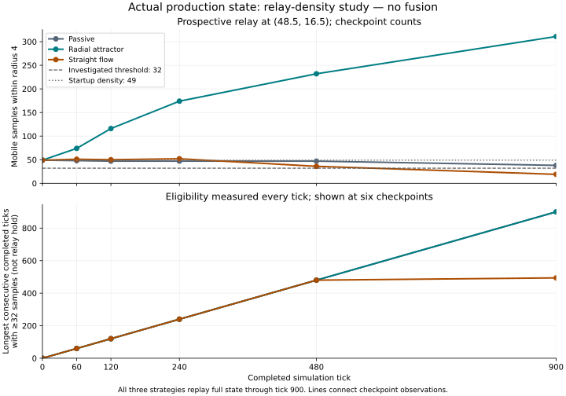

# Phase 9 receiving: concept coherence and actual relay density

Status: in progress, 2026-10-05. Dispatch baseline PR21 merge
`a95c5111991f441a451df144fdf443d2379a0939`. Fresh source checkout matches main;
Git LFS fetched the two concept boards and Phase8 flow captures. No prior session
workspace or artifact was altered.

## Source and review

Structural and arena workers supplied independent conserved traces and a production
consumer density experiment. Arena worker independently reviewed structural/spike
identity, command, query and replay boundaries. Architect reviewed source and central
docs; identified startup49 versus threshold32 and replaced speculative exchange
implementation with a gated future consumer. No production gameplay code/pin changed.

`cpp-write`/`cpp-review` were referenced by repository guidance but are unavailable
in the current catalog and searched skill/workspace directories. Existing C++23
patterns, independent source review and actual supported acceptance are retained.

## Frozen experiment

Linux x86_64, GCC13.3.0, installed CMake/Ninja; production default ScenarioOptions,
64×32 unit cells, 2,048 samples, four fields. One command before first boundary:
radial center(48.5,16.5)/radius8/strength4 or FLOW(24.5,16.5)→(48.5,16.5)/radius8/strength4;
passive has none. No objective latch, no modeled structural transition.

Relay query is inclusive radius4 at (48.5,16.5); threshold32 stays fixed.
Every tick checks owned-snapshot brute force against production spatial queries and
conservation. Checkpoints0/60/120/240/480/900 retain all six ledger fields, count,
delta and consecutive eligible durations. Each strategy independently replays its
actual field trace through900 and compares complete state. A tiny hand-count fixture
receives exact radius-boundary inclusion before the runs.

## Local receiving and observed result

GCC13.3.0 / CMake4.4.4 / Ninja1.13.2 on Linux x86_64:

- Debug:30/30 passed. After adding cumulative count minima/maxima, targeted
  density/query/full-replay receiving passed1/1 again through120.
- Release:30/30 passed; the final count-metadata change received its targeted1/1
  rerun. The full900-tick study passed all three independent terminal replays.
- Full Debug investigation exceeded the initial180-second bound; the incomplete
  buffered output is retained outside the publication tree and cannot render as
  complete evidence. CTest now receives the same three strategies through120,
  while the full investigation runs separately in Release.
- Normal local sanitizer compile passed but the leak-enabled runtime canary
  failed because `/proc/.../task` cannot be read. No leaks were disabled;
  hosted ASan/UBSan with normal leak checking is required before merge.
- Changed Markdown file/image links resolve; whitespace checks pass. Plot script
  rejects incomplete timed-out JSONL and requires three successful tick900 replays.

| Strategy | Tick0 | Tick60 | Tick120 | Tick240 | Tick480 | Tick900 | Maximum at any observed tick0..900 |
|---|---:|---:|---:|---:|---:|---:|---:|
| Passive | 49 | 48 | 47 | 47 | 47 | 38 | 51 |
| Radial attractor | 49 | 74 | 116 | 174 | 232 | 311 | 312 |
| Straight FLOW | 49 | 51 | 50 | 52 | 36 | 19 | 54 |

All2,703 observed strategy/tick states conserve the full ledger and match the
independent inclusive-radius oracle. [Raw JSONL](../../investigations/phase9/relay-density.jsonl)
retains18 checkpoint records and three complete replay receipts.
[Capture receipt](../../investigations/phase9/receipt.json) records checkpoint,
dirty state, exact source/executable/output hashes and reproduction.

This SVG was rendered and visually inspected for axes, complete labels, distinct
strategies and honest threshold/hold classification. Lines connect checkpoint counts;
longest duration is measured every tick against the original32 threshold, not the
selected64 cost or a structure hold. The [arena SVG](../../decisions/phase9-arena-proposal.svg)
was also rendered and inspected; its first three identity badges now follow the
concept board's circle/cyan, triangle/amber and diamond/violet vocabulary. It remains
a design mock, not production evidence.

The [selection](../../decisions/phase9-selection.md) chooses64 anchored identities,
48 shatter survivors and16 lost. Passive/flow never reach64, while radial exceeds64
by tick60; the remaining1,984 mobile identities preserve a reclamation population.
That is an automated concentration gate, not completed fusion, the harvest/hold
mission or human balance. No timing number is a full-game performance claim.

## Hosted receiving and publication

Reviewed checkpoint `eefc8754c34982d6b006e0105996824344594cfd` was published to
[PR22](https://github.com/CraigHutchinson/Crucible/pull/22) before long receiving.
The final reviewed source/evidence SHA, exact-head nine-job CI and actual merge
SHA are recorded in that PR receipt. Publication requires all nine jobs passing
and a matching head-guarded merge; this document does not predict those results.
Recovery PR21 is a publication receipt, not a new test receipt. Hosted suites
include retained Phase8 behavior and the opt-in120-tick spike on desktop Debug/Release,
headless and normal ASan/UBSan. Software Vulkan receiving retains its existing scope.
